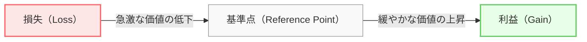

# 📊 行動経済学×データサイエンス：行動経済学の主要理論まとめ ── “人はなぜ合理的でないのか”を理解する【シリーズ第1回｜“意思決定を科学する”プロジェクト】

---
## 🧭 この記事の目的
本記事では、行動経済学の主要理論を整理します。  
「人は合理的に行動する」という古典的経済学の前提が、なぜ現実では崩れるのか。  
代表的な心理バイアスや理論を通して、その背景を理解します。

## はじめに

第0回では、**行動経済学がデータサイエンスにもたらす視点**を紹介しました。  
今回はその基盤となる、**行動経済学の主要理論**を整理していきます。

本シリーズ「意思決定を科学するプロジェクト」では、  
> 人はなぜそのように“選ぶ”のか？  
> そして、その意思決定をどうデータで捉えるか？  

という問いを、心理学とデータ分析の両面から解き明かしていくことを目的としています。

👇 第0回の記事はこちら  
➡️ [🎯行動経済学×データサイエンス：感情を読み解くデータ活用のすすめ【シリーズ第0回｜“意思決定を科学する”プロジェクト】](https://qiita.com/Attsuatsu/items/6eed0bacca176dd9392d)

人は合理的に判断しているようで、実際には多くの「心理的バイアス」に左右されています。  
これを理解することは、“人がどう決めるか”をデータから読み解く第一歩です。

---

## 🧭 この記事の目次
1. プロスペクト理論（Prospect Theory）
2. アンカリング効果（Anchoring Effect）
3. メンタル・アカウンティング（Mental Accounting）
4. 現状維持バイアス（Status Quo Bias）
5. フレーミング効果（Framing Effect）
6. まとめ：理論は「データの解釈」を深くする道具
7. 参考文献・おすすめ書籍

---
## ⚖️ 1. プロスペクト理論（Prospect Theory） 

### ● 提唱者
ダニエル・カーネマン、エイモス・トヴェルスキー（1979）

### ● 概要
人は利益よりも損失に敏感である、という理論です。  
同じ金額でも「失う痛み」は「得る喜び」よりも約2倍強く感じられることが知られています。

### ● 特徴的なグラフ（価値関数）
中心（基準点）を境に、「利益」側はゆるやかに上昇し、「損失」側は急激に下がる形をとります。

### ● 例
- 「1000円得する」より「1000円損する」ほうが心理的ダメージが大きい  
- 株式投資で「損切りできない」のはこの損失回避が原因  

### ● データ分析との接点
A/Bテストや価格設計では、「損失を回避できるように見せる」メッセージの方が反応率が高い場合があります。  
👉 例：「割引価格で得する」よりも「通常価格に戻る前に買わないと損する」

---

## ⚙️ 2. アンカリング効果（Anchoring Effect） 

### ● 概要
最初に提示された情報（アンカー）が基準となり、その後の判断を歪める現象。

### ● 例
- 定価10,000円の商品が「今だけ5,000円」と表示されると、“安い”と感じるのは10,000円というアンカーが効いているため。  
- 採用面接で「最初に高評価の学生を見る」と、後の学生が相対的に低く感じることも。

### ● データサイエンスとの接点
回帰分析や機械学習では「基準値」をどう置くかが結果に影響するように、  
人間の判断も最初の基準値に大きく依存します。  
👉 「初期値設定」「UIの初期表示」などは、実は心理的アンカーを操作している。

---

## 💰 3. メンタル・アカウンティング（Mental Accounting） 

### ● 提唱者
リチャード・セイラー（ノーベル経済学賞受賞）

### ● 概要
人はお金を心の中で“用途別の財布”に分けて管理している、という考え。  
実際の金額は同じでも、“どの財布から出すか”で意思決定が変わります。

### ● 例
- 「ボーナス」は貯金よりも“贅沢”に使ってしまう  
- 「ギャンブルで勝ったお金」は“余分な収入”として浪費しやすい  

### ● データ分析との接点
家計簿データや消費データを分析する際、支出カテゴリや収入源によって行動パターンが異なります。  
「収入源別 × 支出項目別」にクラスタリングすると、この理論を裏づける傾向が見えることも。

---

## 🧠 4. 現状維持バイアス（Status Quo Bias） 

### ● 概要
人は“変化”よりも“今のまま”を好む傾向があります。  
理由は、変化に伴う不確実性やリスクを過大評価するため。

### ● 例
- 保険やサブスクを「なんとなく継続」してしまう  
- 新しいツールより、慣れたツールを選び続ける  

### ● データサイエンスとの接点
サービス利用継続率（Retention）を上げる際、  
“現状維持バイアス”を利用して、解約を面倒にするよりも、  
「変更の不安」を減らす設計が有効。

---

## 🧭 5. フレーミング効果（Framing Effect） 

### ● 概要
同じ内容でも、表現（フレーム）の仕方で意思決定が変わる現象。

### ● 例
- 「成功率90%」と「失敗率10%」は同じ意味だが、印象が全く違う  
- 医療や保険の広告でよく利用される  

### ● データサイエンスとの接点
UX文面や通知設計では、表現のフレームによってクリック率やコンバージョン率が変化します。  
👉 NLP分析でテキストのフレーミング効果を定量化する研究も進んでいます。

---

## 📊 まとめ：理論は「データの解釈」を深くする道具 

行動経済学の理論は、単に“心理の話”ではありません。  
これらを知ることで、データサイエンスの「なぜこの数値差が生まれたのか？」を  
より人間的に理解できるようになります。

| 理論名 | 主な現象 | データ活用のヒント |
|--------|------------|------------------|
| プロスペクト理論 | 損失回避 | 割引・通知文面の設計 |
| アンカリング効果 | 初期値依存 | UI設計・初期設定 |
| メンタル・アカウンティング | 心の財布分け | 支出クラスタリング |
| 現状維持バイアス | 変化回避 | サブスク継続率改善 |
| フレーミング効果 | 表現で変わる判断 | A/Bテスト文面分析 |

次回は、これらの理論を**Pythonでデータ化・可視化**し、  
どのように数値として扱えるかを見ていきます。

>次回：「📊 行動経済学×データサイエンス：心理を数値化する ― 行動経済学をデータ分析に取り込む【シリーズ第2回｜“意思決定を科学する”プロジェクト】」

---

## 参考文献-おすすめ書籍

📘 『**予想どおりに不合理** 』（**ダン・アリエリー著** ）

>「人はなぜ、非合理な選択をしてしまうのか？」
行動経済学の原点ともいえる一冊。ビジネスやマーケティングにも応用可能。
非常に読みやすくて、おすすめの一冊です！

- 🔗 [Amazonで見る](https://amzn.asia/d/gaVeQIA)

---

### 💡 シリーズタイトル
>行動経済学×データサイエンスシリーズ
― “意思決定を科学する”プロジェクト ―

---
